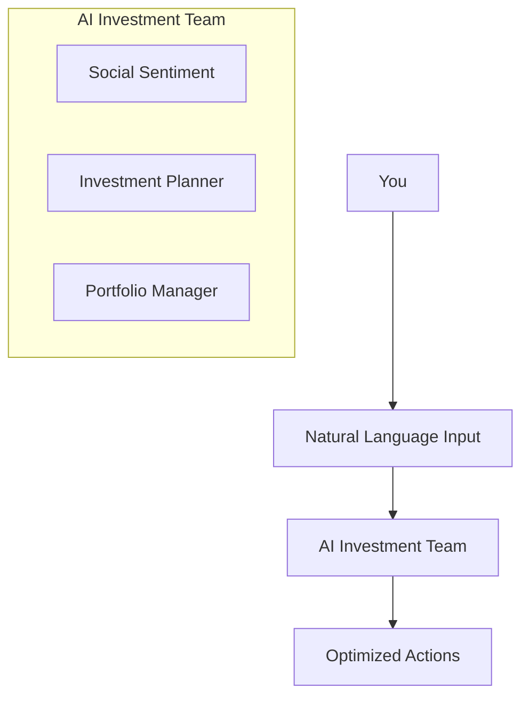

# Moti-fi: Your AI Investment Team on Base

Meet your personal team of AI agents that work together to manage your Web3 investments. Like having expert analysts, traders, and risk managers in your pocket - but powered by advanced AI and running 24/7 on Base.

## 🤔 Why Moti-fi?

Managing crypto investments is challenging. Ever faced these issues?

-   Keeping track of multiple investments across protocols
-   Deciding the right time to buy or sell
-   Understanding market sentiment and trends
-   Reacting quickly to market opportunities
-   Making sense of complex market signals

We built Moti-fi to solve these challenges with AI precision.

## ✨ Your Personal AI Investment Team

Think of Moti-fi as your personal investment team:

### 🧠 Social Sentiment Agent

-   Tracks social signals and influencer activity
-   Monitors market sentiment in real-time
-   Identifies trending topics and discussions
-   Provides early market movement indicators

### 🧠 Investment Planner Agent

-   Analyzes top coins using advanced AI
-   Identifies market trends and opportunities
-   Provides clear investment recommendations
-   Processes market data and social signals

### 💼 Portfolio Manager Agent

-   Executes trades with precision
-   Manages investment positions
-   Implements risk control measures
-   Tracks portfolio performance

## 🎯 How It Works



## 🛠️ Technology Stack

Built with enterprise-grade partner technologies:

### Frontend

-   **Framework**: Next.js 14
-   **UI Components**: Shadcn/ui
-   **Styling**: TailwindCSS
-   **Web3 Integration**: OnchainKit

### Backend

-   **AI Engine**: Gaia LLM
-   **Blockchain**: Base Network
-   **Agent Framework**: CDP AgentKit
-   **Development Kit**: CDP SDK
-   **State Management**: Zustand
-   **Type Safety**: TypeScript, Zod

## 🚀 Getting Started

1. Clone & Install

```bash
git clone https://github.com/yourusername/moti-fi.git
cd moti-fi
bun install
```

2. Set up your environment

```bash
cp .env.example .env.local
# Add your configuration
```

3. Launch

```bash
bun run dev
```

## 💡 Real World Examples

### Smart Portfolio Management

```text
You: "Markets are moving - what should I adjust in my portfolio?"

Your AI Team:
1. Market Expert analyzes current trends
2. Risk Guardian checks potential risks
3. Portfolio Manager suggests optimal moves
```

### Intelligent Trading

```text
You: "Find good trading opportunities while maintaining safety"

Your AI Team:
1. Risk Guardian sets protective limits
2. Market Expert identifies opportunities
3. Portfolio Manager executes with precision
```

## 📄 License

MIT

## 🤝 Join Us

Have ideas to make Moti-fi even better? We'd love to hear from you!
