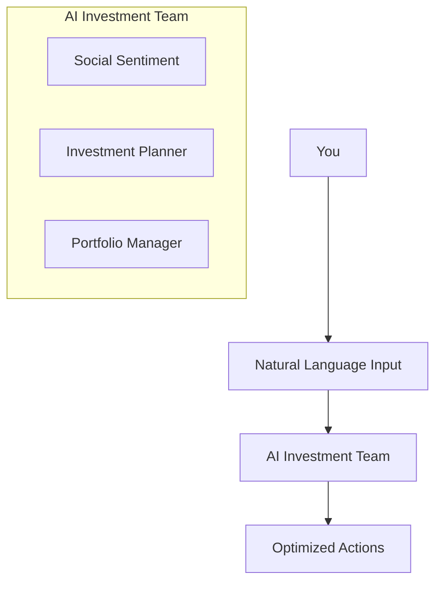

<a href="https://emotisync.xyz">
  
  <h1 align="center">🤖 MotiFi: Your Autonomous AI Agents Investment Manager</h1>
</a>

<p>
MotiFi is a team of specialized autonomous AI agents that work together to streamline the management of your Web3 investments. Like having expert analysts, traders, and portfolio managers in your pocket 24/7 to help you navigate the crypto market with confidence.
Currently live on Base, powered by AgentKit and LangChain.
</p>

## 🤔 Problem

Managing crypto investments is challenging. Ever faced these issues?

-   Keeping track of multiple investments across protocols
-   Deciding the right time to buy or sell
-   Understanding market sentiment and trends
-   Reacting quickly to market opportunities
-   Making sense of complex market signals

## 🎯 Solution

We built Moti-fi to solve these challenges with AI precision.
Our agents work collaboratively to provide real-time insights and automated trading capabilities, ensuring that you can make informed investment decisions quickly and efficiently.

## ✨ Features

Think of Moti-fi as your personal investment team:

### 🤖 Social Sentiment Agent

-   Tracks social signals and influencer activity
-   Monitors market sentiment in real-time
-   Identifies trending topics and discussions
-   Provides early market movement indicators

### 🧠 Investment Planner Agent

-   Analyzes top coins using advanced AI
-   Identifies market trends and opportunities
-   Provides clear investment recommendations
-   Processes market data and social signals

### 💼 Portfolio Manager Agent

-   Executes trades with precision
-   Manages investment positions
-   Implements risk control measures
-   Tracks portfolio performance

## 🎯 How It Works

Simply by natural language input

1. Social Sentiment Agent: Scan social media and twiiter for real-time sentiment trends across crypto assets.
2. Investment Planner Agent: Analyze sentiment data and market indicators to uncover investment opportunities.
3. Portfolio Manager Agent: Automatically execute trades and manage portfolio risk with precision.



## 🛠️ Tech Stack

Built with enterprise-grade partner technologies:

### Frontend

-   **Framework**: Next.js 14
-   **UI Components**: Shadcn/ui
-   **Styling**: TailwindCSS
-   **Web3 Integration**: OnchainKit

### Backend

-   **AI Engine**: Gaia LLM
-   **Blockchain**: Base Chain
-   **Agent Framework**: Coibase Developer Platform AgentKit
-   **Development Kit**: Coibase Developer Platform SDK
-   **Agent Orchestration**: Langchain
-   **Type Safety**: TypeScript, Zod
-   **Formatter & Linter:** Biome
-   **Package Manager:** Bun

## 🚀 Getting Started

1. Clone the repository

```bash
git clone https://github.com/yourusername/moti-fi.git
```

2. Install dependencies

    ```bash
    cd frontend
    bun install
    cd agent
    bun install
    ```

3 Set up your environment

```bash
cp .env.example .env.local
# Add your configuration
```

3. Launch

```bash
bun run dev
```

## 💡 Real World Examples

### Smart Portfolio Management

```text
You: "Markets are moving - what should I adjust in my portfolio?"

Your AI Team:
1. Market Expert analyzes current trends
2. Risk Guardian checks potential risks
3. Portfolio Manager suggests optimal moves
```

### Intelligent Trading

```text
You: "Find good trading opportunities while maintaining safety"

Your AI Team:
1. Risk Guardian sets protective limits
2. Market Expert identifies opportunities
3. Portfolio Manager executes with precision
```

## Roadmap

-   [ ]
